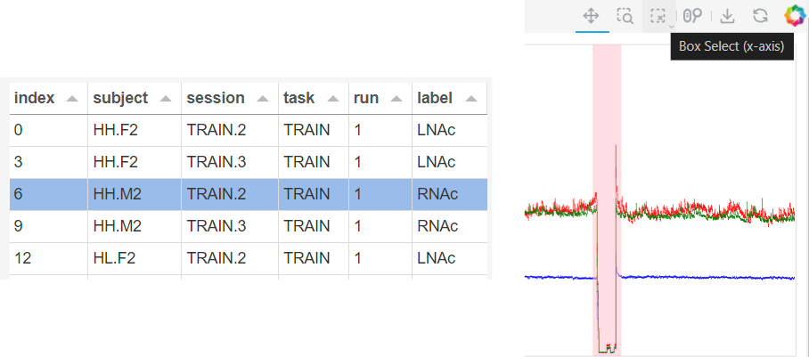

# behapy
Behavioural neuroscience data wrangling and analysis tools

## Installation

Execute the following from the project folder in a shell with conda on the path:

```bash
conda env create -f environment.yaml
conda activate behapy
pip install -e .
```

## Preprocessing

To use behapy, the TDT proprietary formatted source data needs to first be converted BIDS-like raw data format. This assumes session_map.csv is in the sourcedata_root folder:

`tdt2bids [session_fn] [experiment_fn] [bidsroot]`

Alternatively, you can specify the source data directory with --sourcedata_root. (Note that this path is relative to session_fn and not the current directory.):

`tdt2bids [--sourcedata_root sourcedata_root] [session_fn] [experiment_fn] [bidsroot]`

This will output raw data files in 
`[bidsroot]/rawdata`

Next open the preprocessing dashboard and identify regions of the recording for exclusion from analysis:

`ppd [bidsroot]`

The preprocessing dashboard will open in a browser window. Select a recording by index to pull up an interactive bokeh plot of raw fluorescence and normalised fluorescence. Then use the box-select tool to exclude time points from analysis.



Finally, write the preprocessed data to the `[bidsroot]/derivatives/preprocess` tree:

`preprocess [bidsroot]`

## Demo Notebooks

A sample annotated analysis pipeline is available in `examples/analyse.ipynb`

There is a MedPC event reading example in `examples/showevents.ipynb`


## Contributors

behapy is maintained by [Chris Nolan](https://github.com/crnolan).

This project would not exist without the energetic contributions from folks in the BrainHack community. Thanks in particular to:

* [Thomas Burton](https://github.com/thomasjburton)
* [Karly Turner](https://github.com/karlyturner)
* [Phil JRDB](https://github.com/philjrdb)
* [Dylan Black](https://github.com/dylanablack)
* [Ilya Kuzovkin](https://github.com/kuz)
* [Daniel Naoumenko](https://github.com/dnao)
* [Almudena Ramirez](https://github.com/almudena607)
* [Joanne Gladding](https://github.com/jmgladding)
* [Lydia Barnes](https://github.com/lydiabarnes01)
* J Bertran-Gonzalez
